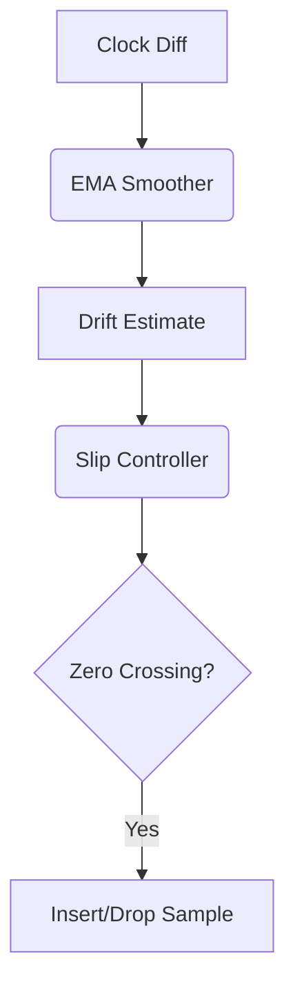

# drift-slip-controller-mioarani


## Overview
Clock drift estimator and sample slip controller for zero-crossing modifications.

## Architecture



## Interface
```go
// Core exported structs, traits, or functions
```

## Agent Handoff / Continuation
Copied drift.go and slip.go. Need to bundle into one package, define DriftSource interface for decoupling.
